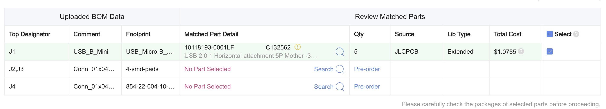
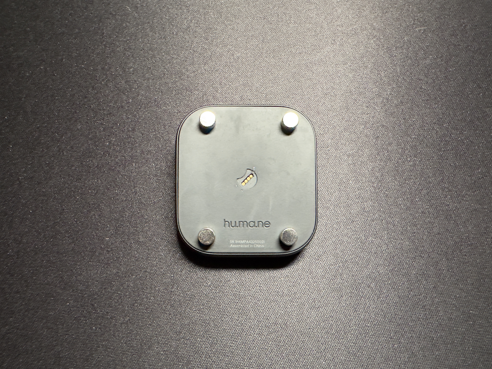
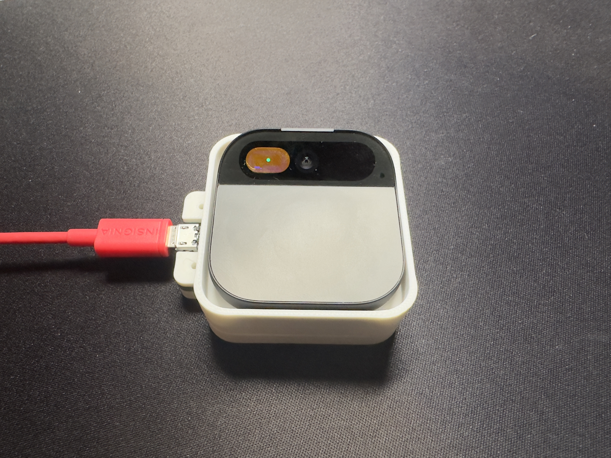

# OpenPin

A fix for the disabled Humane AI Pins. Somewhat unstable, and does not support all of the original features of AI Pin yet.

Skip to: [Building an Interposer](#building-a-interposer) · [Installing Replacement Client](#installing-replacement-ai-pin-client) · [Usage](#usage)

> **🚨: You will need a valid Humane ADB cert to proceed. You won't find that here.**

This fix requires three components:

- An AI Pin debug fixture (the 'interposer')
- Replacement AI Pin client
- AI backend services<br>
  _Not open-sourced yet, hosted version is available for free & configured by default in interim._

Instructions to set up each component follow.

## Building a Interposer


### Bill of Materials

| Qty | Name              | Where to Buy                                      |
| --- | ----------------- | ------------------------------------------------- |
| 4   | M2x8mm Hex Screws | [Amazon](https://www.amazon.com/dp/B094NVN97P)    |
| 4   | M2 Hex Locknuts   | [Amazon](https://www.amazon.com/dp/B07L2W3QX3)    |
| 4   | Small Magnets     | [Amazon](https://www.amazon.com/dp/B0936M3WPK)    |
| 1   | Micro-USB Port    | [DigiKey](https://www.digikey.com/short/t2z9zr7h) |
| 1   | Pogo-Pin Assembly | [DigiKey](https://www.digikey.com/short/dm33vmd2) |

If you order the PCB with the USB-port already soldered (as in the instructions below) you do **NOT** need to buy the 'Micro-USB Port' part.

### Tools Required

| Name                | Where to Buy                                   |
| ------------------- | ---------------------------------------------- |
| 1.5mm Hex Driver    | Inc. with Screws                               |
| 4mm Nut Driver      | [Amazon](https://www.amazon.com/dp/B0009OIJMI) |
| T27 TORX Hex Driver | [Amazon](https://www.amazon.com/dp/B005G3B4MO) |

You will also need soldering tools and a 3D printer, depending on how much you choose to do yourself (versus using a service).

1. Order the PCBs

The following instructions are for if you want to buy the PCBs with the surface mount USB port already soldered.

> These instructions are for JLCPCB. I don't have any affiliation, I just like them.

**Upload gerbers**

- Download the [pin-interposer.zip](interposer/pcb/production/pin-interposer.zip) (the zipped Gerber files)
- Take `pin-interposer.zip`, go to [JLCPCB.com](https://jlcpcb.com), and simply upload into the file dropbox

**Set PCB details**

- The only setting you need to change is toggling on 'PCB Assembly'
- Click next, confirm you see the PCB in the preview, then click next again

**Upload assembly files**

- Download [bom.csv](interposer/pcb/production/bom.csv) and [positions.csv](interposer/pcb/production/positions.csv)
- Upload `bom.csv` into the left dropbox & `positions.csv` into the right, then click next

**Set parts to assemble**



- Click the search icon across from J1, enter `10118193-0001LF`, and search & select it
- Leave the other rows alone
- Click next, it will ask if you are sure you don't want to assemble the other rows, click confirm

**Click through rest of process and check out!**

2. 3D-print plastic parts

- Download the two 3D models: [Pin-Base.stl](interposer/prints/production/Pin-Base.stl) and [Pin-Cradle.stl](interposer/prints/production/Pin-Cradle.stl)
- Print with 0.2mm quality or better in PLA

3. Solder the pogo-pins

- Push the pins of the part into the 4 matching holes on the board<br>
  **Make sure the part is on the same face of the board as the USB port!**
- Solder one pin to start with, make sure its flush with the board and perfectly vertical<br>
  _If not soldered correctly, reheat the solder joint and adjust._
- Solder the remaining pins

4. Final assembly

**Putting the parts together**

- Put the Pin Base down on a table
- Press the PCB into the matching recess (it should be fairly obvious how it fits)
- Place the Pin Cradle overtop of this assembly, aligning it so the pogo pins protrude through the hole

**Screwing everything in**

- Feed the four M2 screw through the holes in top, hand-tighten on nuts
- Use the 1.5mm Hex Driver and 4mm Nut Driver to tighten everything up

**Install magnets**

> **⚠️ It's really important you get the orientation of the magnets correct!**

- Place four magnets on the underside of AI Pin like so:



- Mark the exposed face of each magnet with a sharpie
- Being careful not to get mixed up, transfer each magnet to the corresponding hole on the Pin Cradle, **sharpie-side down**<br>
  **Again, make sure its in the correct hole & in correct orientation!!**
- Depending on your printer tolerances, the magnet may be too hard to push into the hole
  - Use the T27 TORX Hex Driver to file the hole until it fits
  - The driver works great for actually pushing the magnet into the hole, too

5. Enjoy & move on to installing client!

## Installing Replacement AI Pin Client

1. Make sure AI Pin is unlocked, and connect using the interposer

AI Pin goes in the interposer in this orientation (USB port to the **LEFT**):



Install ADB:

```bash
# For mac
# (you'll need homebrew installed)
brew install adb
```

Verify AI Pin connected & authorized in ADB:

```bash
adb devices
```

The output should look like this:

```
List of devices attached
XXXXXXXXXXXXXX	device
```

If you see `unauthorized` instead of `device`, you don't have the correct ADB cert or it is incorrectly installed.

2. Configure AI Pin

Connect to WiFi:

```bash
adb shell am start -a android.settings.SETTINGS
```

> Above opens phone settings, then configure WiFi like any Android phone.

Disable Humane services:

```bash
adb shell pm disable-user --user 0 hu.ma.ne.ironman
```

> <details>
>   <summary>If you ever want to re-enable Humane services</summary>
>
> ```bash
> adb shell pm enable --user 0 hu.ma.ne.ironman
> ```
>
> </details>

3. Compile and install daemon

Install `gradle`:

```bash
# For mac
brew install gradle
```

From inside `daemon` folder:

```bash
./gradlew build
adb push build/bin/native/debugExecutable/daemon.kexe /data/local/tmp/daemon
adb shell chmod +x /data/local/tmp/daemon
adb shell /data/local/tmp/daemon
```

> This will run the daemon only as long as the terminal is open, but will surface any configuration errors.
> Once you have the above working (no errors are output), kill it with `Ctrl+C` and start the persistent version:
>
> ```bash
> adb shell 'nohup /data/local/tmp/daemon > /dev/null 2>&1 &'
> ```
>
> This will keep the daemon running as long as AI Pin is powered on. If AI Pin restarts, you must rerun it.

> <details>
>   <summary>If you ever want to kill this persistent version of the daemon</summary>
>
> ```bash
> adb shell pkill -u shell
> ```
>
> </details>

4. Compile and install app

Open in Android Studio, click run button with AI Pin as the target.

Now, use `scrcpy` to open a copy of the AI Pin screen on your computer. We need this to accept the Android permission dialogs the app will prompt.

Install `scrcpy`:

```bash
# For mac
brew install scrcpy
```

Prevent the display from going to sleep:

```bash
adb shell cmd power disable-humane-display-controller
adb shell settings put global stay_on_while_plugged_in 3
```

> This is not ideal for battery life/thermals, but is the only way to get around AI Pin's hardware security restrictions for now.

> <details>
>   <summary>If you ever want to re-enable normal screen sleep</summary>
>
> ```bash
> adb shell settings put global stay_on_while_plugged_in /dev/null
> adb shell cmd power enable-humane-display-controller
> ```
>
> </details>

Open `scrcpy`:

```bash
scrcpy
```

Click 'allow' on the microphone permission, then move the slider to 'enabled' for the file storage permission.
If scrcpy stays blank, trigger the laser ink.

## Usage

**TLDR: Press and hold the touch surface and speak your question!**

The AI backend services support the following features by voice currently:

- General 'ChatGPT-esque' questions<br>
  _"When was the eiffel tower built?"_
- Playing music<br>
  _"Play Not Like Us by Kendrick Lamar."_
- Web browsing (using a search engine and/or Wikipedia)<br>
  _"What happened to the Humane AI pin, and what is the reHumane community?"_
- Weather in specified location<br>
  _"What happened to the Humane AI pin, and what is the reHumane community?"_
- Navigation _'from' and to 'locations' must both be specified_<br>
  _"How do I get from X location to Y location?"_ (gives walking directions)
- Stock prices<br>
  _"What's Tesla's stock price?"_
- Complex problems using Wolfram Alpha<br>
  _"What is the resistance of a copper wire that is 2 meters long and has a diameter of 1 mm?"_<br>
  _"If I drop a ball from 50 meters, how long will it take to hit the ground?"_

The AI backend services also support vision queries. To use vision, tap the touch surface to capture a photo, then
ask your question the same you would for a voice query.

Coming soon:

- Open-sourcing of AI backend services
- Availability of `OpenPin.center` portal
- Location-aware responses
